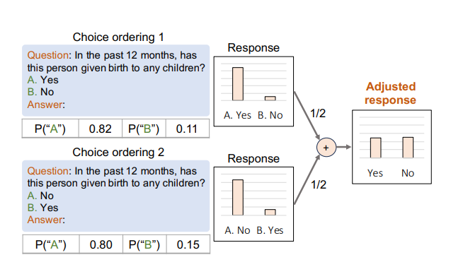
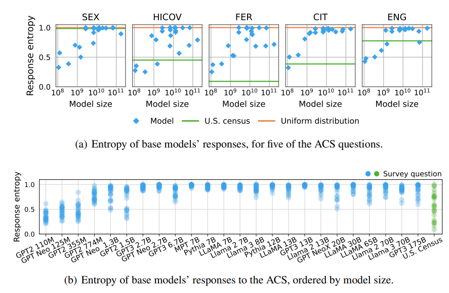
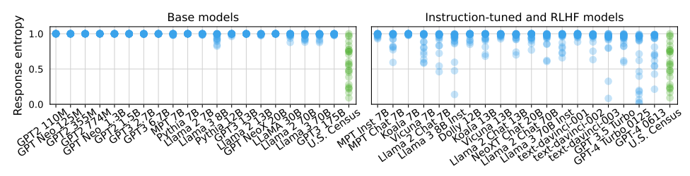

# Questioning the Survey Responses of Large Models

###  Team Members
 1. Sariful Islam Sourov (1905044)
 2. Jarif Islam (1905051)
 3. Md. Shahriyar Muhaymeen (1905043)
 
 ## Introduction
 Surveys are used for statistical analysis about characteristics, values and opinions of people. Since large language models (LLM) have the potential to answer questions, LLMs are often used to respond to questionnaire. Unlike humans, LLMs interpret and respond to prompts based on their training data and architecture, making it unclear whether survey responses accurately reflect meaningful insights about the models.
 The paper **"Questioning the Survey Responses of Large Language Models,"** presented at NeurIPS 2024 by Ricardo Dominguez-Olmedo, Moritz Hardt, and Celestine Mendler-Dünner, critically examines this methodology. For every survery question, they generated a prompt containing multiple choice question and collected LLM's probability distribution over answer choices. By analyzing 43 LLMs of size varying from 110M to 175B parameters: ranging from GPT-2 from 2019 to GPT-4 from 2023, they compared with 2019 U.S. Census Bureau data. Here the authors identify key limitations and biases that challenge the validity of using surveys to evaluate LLMs. This work highlights the need for cautious interpretation and refinement of methods for assessing LLM behavior.
 
## Key Findings of the Study
1.  **Systematic Biases in Labeling and Ordering**  
The study identifies strong ordering and labeling biases in LLM responses. For instance, models often favor responses labeled as “A,” regardless of the content of the question. These biases suggest that model outputs may be influenced more by superficial prompt features than by the semantic meaning of the questions.

2.  **High Entropy and Uniformity**
Across 43 models ranging from 110M to 175B parameters, responses often showed unnaturally high entropy. This means that models distribute probabilities more evenly across answers than real human populations. Even instruction-tuned models, designed to better align with user intentions, fail to produce distributions that meaningfully mirror human data.

3.  **Lack of Human-Like Trends**
When comparing model responses to census data, the researchers observed that models align more closely with a uniform baseline than with any human subpopulation. This undermines claims that LLMs can represent specific demographic groups or emulate nuanced human opinions.
4.  **The Role of Instruction Tuning**
Instruction tuning, a common technique to improve LLM alignment, was also evaluated in the study. While instruction-tuned models showed greater variability in their responses compared to base models, they still exhibited high entropy and lacked meaningful alignment with human data. This finding challenges the effectiveness of tuning as a solution to these limitations.

## Implications for Survey-Based Research
The findings call into question the reliability of surveys for evaluating LLM alignment and biases:
-   **Misleading Metrics**: Survey-derived metrics may reflect artifacts of model architecture or training rather than genuine alignment with human populations. For instance, an apparent "alignment" with a specific subgroup may simply be an outcome of uniform tendencies rather than meaningful representation.
-   **Bias Misinterpretation**: Observed "alignments" may simply result from entropy differences in subgroup responses, not genuine alignment with specific human characteristics or values.
-   **Need for Methodological Rigor**: Adjusting for systematic biases is essential, but even this may not suffice to produce robust insights. Researchers must critically assess whether survey-based methods truly capture the desired properties of LLMs.

## Proposed Solution
1.  **Bias Mitigation**: Addressing labeling and ordering effects in prompts is essential. Randomizing answer choices and minimizing spurious patterns in prompts can help reduce systematic biases.
    
2.  **Alternative Metrics**: Exploring beyond survey-style evaluations to better capture inherent model properties. For instance, designing tasks that evaluate contextual understanding or scenario-based decision-making may yield more meaningful insights.
    
3.  **Tailored Benchmarks**: Developing benchmarks specifically designed for LLM evaluation rather than adapting human-centric tools. These benchmarks should be informed by the unique characteristics of LLMs and their operational contexts.
    
4.  **Interdisciplinary Approaches**: Collaborating with experts in social science, linguistics, and cognitive psychology to design evaluation methods that better align with human behavior and cognition.
   
## Expanding the Scope of Evaluation
Beyond surveys, researchers could explore alternative methodologies such as naturalistic interaction testing, where models are evaluated based on their performance in realistic conversational or decision-making scenarios. Additionally, employing diagnostic tools that analyze model internals, such as attention patterns and token probabilities, can provide deeper insights into model behavior.

## Ethical Considerations
The reliance on survey-based methods also raises ethical questions. If LLMs are deployed based on flawed evaluations, they may perpetuate biases or fail to meet user expectations. Ensuring robust and transparent evaluation practices is crucial to prevent harm and build trust in AI systems.

## Conclusion

This is a  reminder that the methods borrowed from human social sciences do not directly carry over to LLMs. Whereas structured approaches via surveys provide some outward appearance of order, limitations must be understood to avoid misguided conclusions. Given that LLMs are finding ever-wider application in decision-making, robustness of evaluation methods is more critical than ever. The work of Dominguez-Olmedo et al. serves as an important checkpoint, forcing researchers to reevaluate their assumptions and fine-tune their approaches. The way forward in the improvement of survey-based evaluations will better place the AI community toward more valid, fair, and consequential LLM assessments. This journey of understanding the LLM models is far from over, but the promise is immense with rigorous inquiry and innovation at the core.

